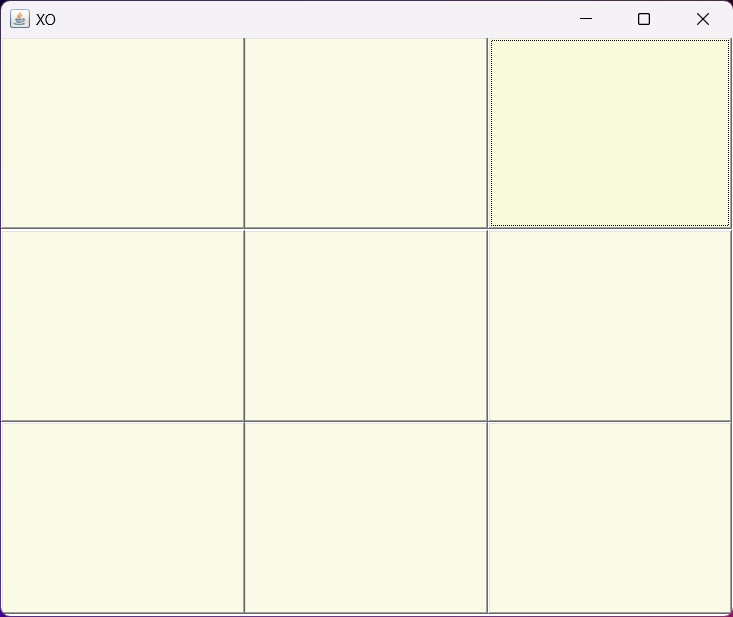
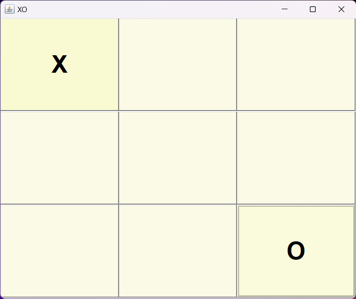
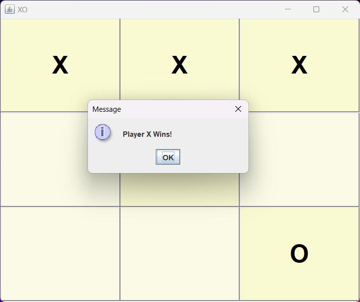
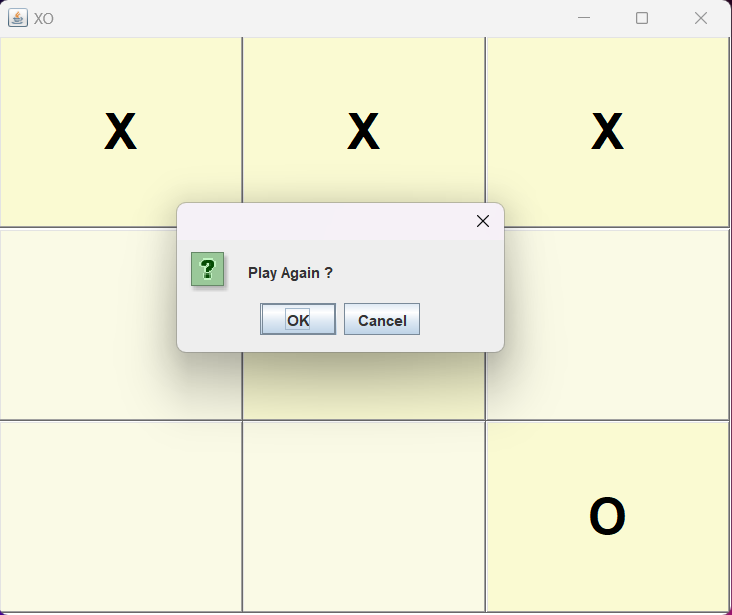

# 🎮 Tic Tac Toe (XO Game) in Java

A simple **Tic Tac Toe (XO)** game built using **Java AWT**.  
Play as **Player X** or **Player O**, with a clean UI, automatic win detection, and replay support.

---

## ✨ Features
- 🎨 Simple and clean AWT UI  
- 🔁 Two-player mode (X vs O)  
- 🏆 Automatic win detection  
- 🤝 Detects ties (draws)  
- 🔄 Play again without restarting  
- ❌ Prevents overwriting cells  

---

## 🚀 How to Run

1. Clone this repository:
   ```bash
   git clone https://github.com/username/java-tictactoe.git
   cd java-tictactoe

---

2. Compile the game:
   ```bash
    javac mframe.java

---

1. Run it:
   ```bash
   java mframe

---

## 📸 Screenshots

Game Board
<p align="center">
  
</p>
<p align="center">
  
</p>
<p align="center">
  
</p>
<p align="center">
  
</p>
•Winning popup:

    •"Player X Wins!"

    •"Player O Wins!"

•Tie popup:

    •"Game Tied"


## 🧩 Code Highlights

•Uses AWT Frame + GridLayout for UI.

•FocusHandler changes button colors when focused.

•ActionListener controls turn switching (X ↔ O).

•Detects win & tie conditions after every move.

•Includes resetGame() method to restart easily.

## 🤝 Contributing

Want to make this game cooler?

•Add score tracking 🏅

•Add AI opponent 🤖

•Improve UI with Swing or JavaFX 🎨

Fork this repo and send a pull request 🚀
